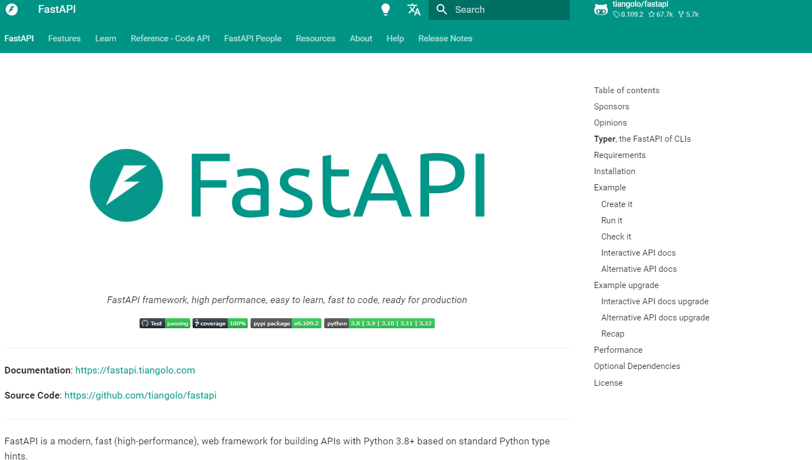
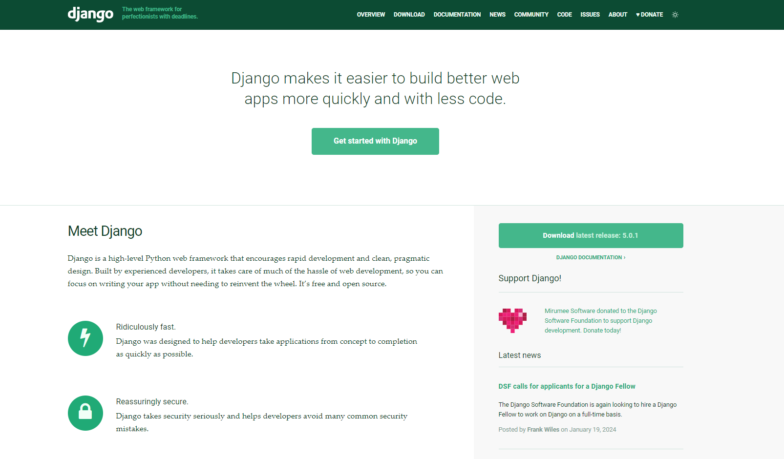
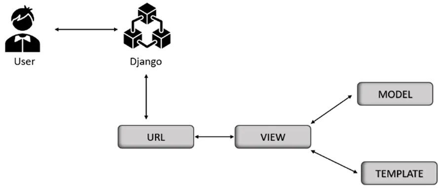

### Exercise: FastAPI vs Django

#### What is FastAPI?

FastAPI is a modern, high-performance web framework for building APIs with Python 3.6+. It is based on the ASGI (Asynchronous Server Gateway Interface) standard, allowing it to handle concurrent requests with async/await syntax. It is designed to be easy to use and learn, with features like intuitive syntax, automatic data validation and serialization, interactive documentation, and extensive testing tools.

**Main Features:**

- **Fast**: One of the fastest web frameworks available, handling over 21,000 requests per second.
- **API-centric**: Supports various data formats and follows the OpenAPI specification.
- **Type-safe**: Uses Python type annotations for defining API parameters.
- **Scalable**: Built on the ASGI standard for asynchronous and concurrent request handling.
- **Secure**: Provides authentication, authorization, encryption, and CORS support.
- **Efficient Documentation**: Offers interactive, intuitive documentation with great editor support.

**Shortcomings:**

- Limited Built-In Security
- Limited Built-In Functionalities
- Learning Curve for Asynchronous Programming

#### What is Django?

Django is a mature, full-stack web framework for building web applications with Python. It follows the MVT (Model-View-Template) pattern, separating the logic, presentation, and data layers of the application. Known for its batteries-included philosophy, Django provides many features and functionalities out of the box.

**Main Features:**

- **Versatile**: Suitable for a wide range of web projects.
- **Productive**: Tools and shortcuts for common tasks and a powerful admin interface.
- **Reliable**: Stable and proven, with a strong community and abundant resources.
- **Secure**: Provides mechanisms to prevent common web attacks and includes a user authentication system.

**Django Architecture:**

**Shortcomings:**

- NoSQL Database Support
- REST Support
- Performance
- Learning Curve
- Interactive Documentation

#### How to Choose Between FastAPI and Django

| Aspect | FastAPI | Django |
| --- | --- | --- |
| Performance | High performance | Suitable for many use cases |
| Ease of Use | Ideal for type annotations | Ideal for readability and simplicity |
| Features | API-centric | Full-fledged web applications |
| Community | Growing, enthusiastic | Stable, long-standing |
| Popularity | Trendy and growing | Widely adopted and proven |
| Routing | Simple and dynamic | Robust URL routing |
| ORM | Choice of ORM | Built-in ORM |
| Learning Curve | Easy to learn | Steeper but well-supported |
| Flexibility | High freedom | Standardized approach |
| Documentation | Interactive | Comprehensive but not interactive |
| NoSQL Support | Supports many NoSQL databases | Not officially supported |
| Security | Tools for security | Strong security features |
| REST APIs | Quick to build REST APIs | Needs Django REST framework |

**Choosing the Right Framework:**

- **FastAPI**: Ideal for high-performance, scalable APIs, and developers who prefer type annotations.
- **Django**: Ideal for full-fledged web applications with built-in functionalities and developers who value readability.