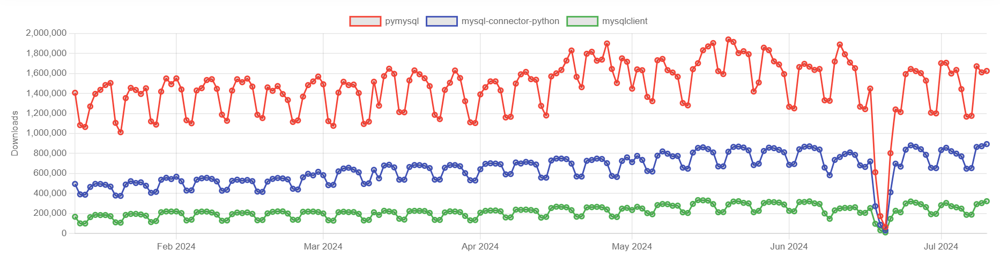

# MySQL Client Libraries for Python

When working with MySQL databases in Python, several libraries are available to connect and interact with the database. Below is a comparison of the main libraries used for this purpose:

## **MySQL-python (MySQLdb)**

**MySQLdb** provides a Python interface to MySQL. It uses the MySQL C API library, allowing Python programs to connect to MySQL databases using C extensions. While known for its performance, it is no longer actively maintained and has largely been replaced by `mysqlclient`.

## **mysqlclient**

**mysqlclient** is a fork of MySQLdb and is actively maintained. It provides the same DB-API interface and is designed to work with Python 3. It is currently one of the fastest MySQL connectors for CPython and requires the `mysql-connector-c` C library.

Key factors contributing to MySQLClient's speed:
1. **C Extension**: Uses a C extension module (`_mysql`) for direct interaction with the MySQL C API.
2. **Efficient Memory Management**: Offers fine-tuned memory management.
3. **Native API Access**: Optimizes data transfer and query execution.
4. **Low-Level Optimization**: Optimizes low-level operations, such as socket communication and data serialization.

## **mysql-connector-python**

**mysql-connector-python** is the official MySQL driver developed by Oracle. It supports both Python 2 and Python 3 and provides a pure Python interface to MySQL databases. It includes features like connection pooling, support for MySQL 8.0, and compliance with the DB-API specification. However, its performance is generally slower compared to other libraries.

## **PyMySQL**

**PyMySQL** is a pure Python MySQL client library. It is actively maintained and provides a DB-API compliant interface without requiring external C libraries, making it easier to install and use in various environments.

### **When to use PyMySQL**

- If you cannot use `libmysqlclient`.
- If you want to use monkeypatched socket of `gevent` or `eventlet`.
- If you need to hack the MySQL protocol.

## **Django Note**

Django's ORM can be used with either the MySQLdb/mysqlclient/PyMySQL API or the "MySQL Connector/Python" API.

## **MySQL DB Drivers Comparison**

| Project                   | PyPi hosted | Eventlet friendly | Python 3 compatibility | Maturity and/or stability | Comment                                                                 |
|---------------------------|-------------|-------------------|------------------------|---------------------------|-------------------------------------------------------------------------|
| mysqlclient               | Yes         | Partial           | Yes                    | Yes                       | Promising DBAPI if eventlet requirement can be dropped                  |
| MySQL-Connector-Python    | No          | Yes               | Yes                    | Yes, though fairly new    | The official Oracle-supported driver for MySQL                          |
| PyMySQL                   | Yes         | Yes               | Yes                    | Yes                       | Actively maintained and popular                                         |

### **Downloads in past 6 Months**

[pymysql vs mysql-connector-python vs mysqlclient](https://piptrends.com/compare/pymysql-vs-mysql-connector-python-vs-mysqlclient)

## **Full Comparison**

| Feature                  | mysqlclient           | PyMySQL                | mysql-connector-python     |
|--------------------------|-----------------------|------------------------|----------------------------|
| Language                 | C extension           | Pure Python            | Pure Python                |
| Compatibility            | Python 3              | Python 2 and 3         | Python 2 and 3             |
| Performance              | Fast, uses C API      | Slower than mysqlclient| Slower than mysqlclient, faster than PyMySQL |
| Installation             | Requires MySQL C API headers | No additional dependencies | No additional dependencies |
| Concurrency              | Supports concurrent threads | Supports concurrent threads | Supports concurrent threads |
| SSL Support              | Yes                   | Requires additional setup | Yes, built-in             |
| Pythonic API             | No, C API interface   | Yes, Pythonic interface| Yes, Pythonic interface    |
| Maintained               | Actively maintained   | Less active            | Actively maintained        |
| Database Compatibility   | MySQL                 | MySQL, MariaDB         | MySQL, MariaDB, Oracle     |
| Features                 | Basic SQL operations Transactions Prepared statements Connection pooling Unicode support Query parameterization | Basic SQL operations Transactions Prepared statements Connection pooling Unicode support Query parameterization | Basic SQL operations Transactions Prepared statements Connection pooling Unicode support Query parameterization |
| Popularity               | Widely used in Python projects | Increasing popularity | Increasing popularity     |

### **Further Reading**

- [Connect MySQL database using MySQL-Connector Python - GeeksforGeeks](https://www.geeksforgeeks.org/connect-mysql-database-using-mysql-connector-python/)
- [Connect to MySQL using PyMySQL in Python - GeeksforGeeks](https://www.geeksforgeeks.org/connect-to-mysql-using-pymysql-in-python/)

