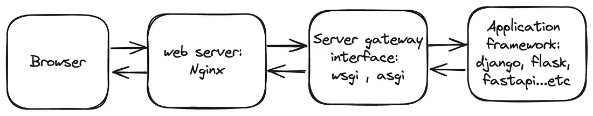

# WSGI vs ASGI

## **WSGI (Web Server Gateway Interface)**

WSGI is a standard interface that separates server code from application code, allowing developers to focus on business logic. It has enabled more freedom and innovation in the Python web space.

- **Synchronous:** WSGI is designed for synchronous web applications, processing one request at a time in a linear manner.
- **Compatibility:** Works well with traditional web servers like Apache and Nginx.
- **Limitations:** Not suitable for handling real-time web features like WebSockets, long-polling, or efficiently managing many concurrent connections.

## **ASGI (Asynchronous Server Gateway Interface)**

ASGI is the asynchronous counterpart to WSGI, adding async capabilities to Python web servers, applications, and frameworks.

- **Asynchronous:** Supports asynchronous programming, allowing it to handle multiple requests concurrently and efficiently.
- **Real-time Communication:** Designed for real-time web features such as WebSockets, Server-Sent Events, and HTTP/2.
- **Flexibility:** Can run both synchronous and asynchronous code, providing more flexibility in application design.
- **Framework Support:** Supported by modern frameworks like FastAPI, Starlette, and newer versions of Django through Django Channels.
- **Scalability:** Better suited for applications requiring high concurrency and low latency.

## **Key Differences**

- **Concurrency:** WSGI handles requests synchronously, while ASGI supports both synchronous and asynchronous processing, making ASGI more suitable for high-concurrency scenarios.
- **Real-Time Capabilities:** ASGI is designed for real-time communications and WebSockets, whereas WSGI is not.
- **Application Types:** WSGI is ideal for traditional web applications, while ASGI is better for applications requiring real-time updates and high concurrency.

## **Difference Between ASGI and WSGI in Django**

| Features                  | WSGI | ASGI |
|---------------------------|------|------|
| Synchronous vs. Asynchronous | WSGI is synchronous, handling one request at a time, and blocking execution until processing is complete. | ASGI is asynchronous, handling multiple requests concurrently without blocking other requests. |
| Concurrency and Scalability | WSGI achieves concurrency through processes or threads. | ASGI efficiently handles concurrency and is recommended for long-lived connections or many clients. |
| Support of HTTP and WebSocket | WSGI supports HTTP only, lacking WebSocket support. | ASGI supports both HTTP and WebSocket, ideal for real-time bidirectional communication. |
| Servers                   | Popular WSGI servers include Gunicorn and mod_wsgi. | Popular ASGI servers include Daphne and Uvicorn. |
| Uses                      | WSGI servers use processes or threads to handle requests individually. | ASGI allows asynchronous code execution, addressing scalability concerns. |
| Protocol Support          | WSGI supports HTTP/1.1. | ASGI supports HTTP/1.1, HTTP/2, and WebSockets. |
| Middleware Compatibility  | WSGI middleware is synchronous, impacting performance in asynchronous applications. | ASGI middleware is asynchronous, ensuring compatibility with asynchronous applications. |

## **Further Reading**

- [An Intro to WSGI and ASGI](https://youtu.be/5TYrPkugT5s)
- [WSGI vs ASGI for Python Web Development](https://medium.com/@commbigo/wsgi-vs-asgi-for-python-web-development-9d9a3c426aa9)